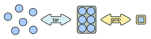

Servers
=======

Most of the commands require to be connected to a server. You can edit your
configuration to any valid ruche server. The servers are designed to be simple,
you need nothing more than a HTTP server that serve an directory statically.

To build you own server you need to valid three things:

* Filesystem Hierarchy
* All the ``ruche.json`` files
* Your archives

Filesystem Hierarchy
--------------------

Each new package gets a dedicated directory. We recommend to the name as simple
as possible (Ex: ``git/`` or ``ruby/``). In this package repository create a
``dist/`` and a ``lib/`` folder. The first one contains the archives that will
be downloaded by the client. The second directory contains additional scripts
that can be useful for some packages (Ex: installation of MySQL as a Windows
service).

Finally create a ``ruche.json`` file in the package directory.

Exemple:
::

  |
  + curl/
  |  + dist/
  |  |  + curl-7.36.0-win32.tar.gz
  |  |  + curl-7.36.0-win64.tar.gz
  |  |  + curl-7.37.0-win32.tar.gz
  |  |  + curl-7.37.0-win64.tar.gz
  |  + lib/
  |  |  + script1.js
  |  |  + script2.js
  |  + ruche.json
  |
  + php/
  ...

Specifications of ``ruche.json`` Files
--------------------------------------

This file lists the available versions of a package and describes them. It's a
JSON array which contains objects. Each object is an available version and has
the following keys:

* **package**: The package name. Must be the same as the parent folder.
* **version**: The version number. ``1.35.2`` is a good value.
* **platform**: Either ``win32`` or ``win64``.
* **bin**: *[optional]* Lists the executables that have to be registered in
  the user PATH. It is an object where keys are the name in the PATH and
  values the path to the executable is the archive.
* **homepage**: A link to the author page.

Exemple:

.. code-block:: json

    [
      {
        "package": "curl",
        "version": "7.35.0",
        "platform": "win32",
        "bin": {
          "curl": "bin/curl.exe"
        },
        "homepage": "http://curl.haxx.se/"
      },
      {
        "package": "curl",
        "version": "7.35.0",
        "platform": "win64",
        "bin": {
          "curl": "bin/curl.exe"
        },
        "homepage": "http://curl.haxx.se/"
      }
    ]

Building an archive
-------------------

The archives must be named as follow: ``package-version-platform.tar.gz``.

.. note:: We recommend `7-Zip <http://www.7-zip.org/>`_ for building archives.

#. Put all your file in a folder named ``package-version-platform``.
#. Use a software to `Tar <http://www.gnu.org/software/tar>`_ this
   folder into a ``package-version-platform.tar`` file.
#. Use a software to `Gzip <http://www.gnu.org/software/gzip>`_ this
   file into a ``package-version-platform.tar.gz`` file.
#. Put this file is the ``package/dist/`` folder of your server.

Exemple:
::

  |
  + curl/
  |  + dist/
  |  |  + curl-7.36.0-win32.tar.gz
  |  |  |  + curl-7.36.0-win32.tar
  |  |  |  |  + curl-7.36.0-win32/
  |  |  |  |  |  + bin/
  |  |  |  |  |  |  + curl.exe
  ...
